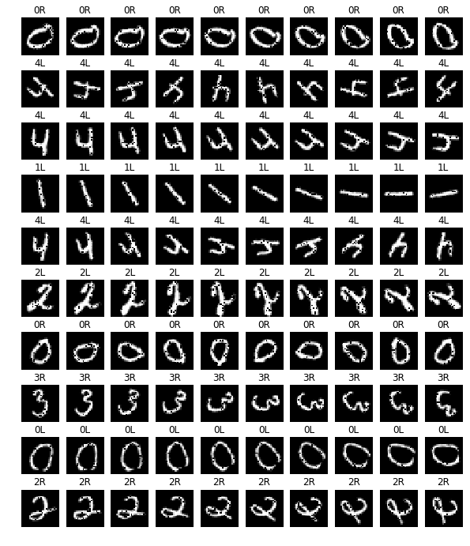
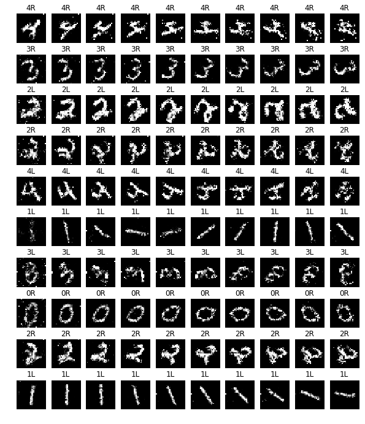

# RCGAN
ラベル情報を考慮した時系列データをGANにより生成する。

## 実行方法
```
python experiment.py
```

デフォルトでは、 `inputs/sin_wave.npz` のデータを入力とする。  
入力の `npz` の形式は以下のような保存形式を想定

```
ndarr_x = np.array([0.0, 0.1], [0.2, 0.3], [0.4, 0.5], [0.6, 0.7]])  # original data
ndarr_y = np.array([0, 1, 2, 3])  # label

np.savez('test.npz', x=ndarr_x, y=ndarr_y)
```

## rotMNIST形式の変換
SyntheticMedDataを直接、GANには読み込めないので、プログラムにより入力形式を変換する。

変換プログラムの実行方法
```
python make_dataset.py
```

`rotMNIST.zip` （rotMNISTから300サンプルを抽出した圧縮ファイル）を解凍することで、動作確認できる。

実行時に必要なパラメータ

- `FILNAME` ：保存先
- `SAMPLES` ：読み込むサンプル数（サンプル数が大きくメモリに載らない場合、データセットを複数作成する。）
- `MAX_SEQ` ：データの系列の長さ（GANではサンプルの系列長を同じ長さに揃える必要がある。）
- `INPUT_DIM' ：データの入力次元数 

## rotMNISTの生成結果
- オリジナル画像



- RCGANにより生成された画像



### 実験環境
```
keras (2.2.4)
tensorflow (1.8.0)
```

### 参考論文
- REAL-VALUED (MEDICAL) TIME SERIES GENERATION WITH RECURRENT CONDITIONAL GANS  
    https://arxiv.org/pdf/1706.02633.pdf
    
- Generative Adversarial Nets  
    https://arxiv.org/pdf/1406.2661.pdf
    
- Conditional Generative Adversarial Nets  
    https://arxiv.org/pdf/1411.1784.pdf
    
- GENERATIVE MODELS AND MODEL CRITICISM VIA OPTIMIZED MAXIMUM MEAN DISCREPANCY  
    https://arxiv.org/pdf/1611.04488.pdf

- Deep Learning with Differential Privacy  
    https://arxiv.org/pdf/1607.00133.pdf

- Improved Techniques for Training GANs  
    https://arxiv.org/pdf/1606.03498.pdf
    
### 参考リポジトリ
- RGAN  
    https://github.com/ratschlab/RGAN

- SyntheticMedData  
    https://github.com/naegawa/SyntheticMedData
    
- opt-mmd  
    https://github.com/dougalsutherland/opt-mmd

- Deep Learning with Differential Privacy  
    https://github.com/tensorflow/models/tree/master/research/differential_privacy
    
- Keras-GAN  
    https://github.com/eriklindernoren/Keras-GAN

 ### その他参考サイト
 - 注目のプライバシー Differential Privacy  
     https://www.jstage.jst.go.jp/article/jssst/29/4/29_4_40/_pdf
